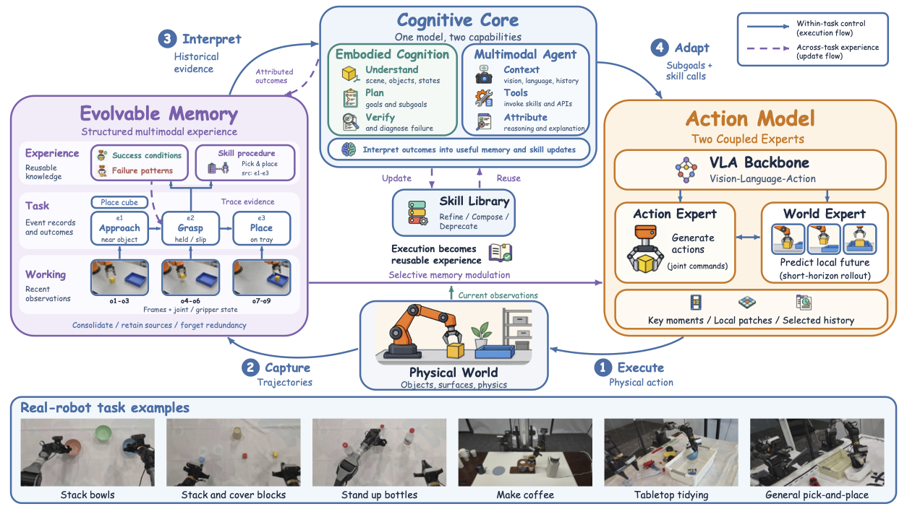

<p>
  
</p>

<h3 align="center">ME-Brain-1.0: Memory, Cognition, and Action for Self-Evolving Embodied Intelligence</h3>

<p align="center">
  <a href="https://arxiv.org/pdf/2609.24271"></a>
  &nbsp;
  <a href="https://machembodied.com/index.html#brain"></a>
</p>

## About

**ME-Brain-1.0** is a self-evolving framework for embodied intelligence that unifies **Evolvable Memory**, **Cognition Core**, and **Action Model**.
Together, these components form a self-evolving loop of action execution, experience acquisition, and experience evolution, enabling robots to autonomously improve through physical interaction without model retraining.



Long-horizon tasks require robots to understand the current scene, remember previous operations and revise plans when conditions change or execution stalls. Three cooperating modules address these needs:

- **Evolvable Memory: hierarchically evolve experience.** Encode vision, actions and task states into structured memories that evolve through short-, mid- and long-term tiers, distilling execution records into reusable cross-task knowledge.

- **Cognitive Core: learn from human demonstrations and evolve strategies.** Draw on human imitation teaching to decompose tasks, invoke tools and skills, verify outcomes, replan based on failure causes, and convert demonstrated experience into reusable skills.

- **Action Model: generate and execute actions.** Focus on the next interaction event, generate actions using relevant history and local future conditions, and feed execution trajectories back into memory.

## Videos
### Grasp Anything

[](https://machembodied.com/ME-Brain/assets/%E6%8A%93%E4%B8%87%E7%89%A9%E5%8D%81%E5%80%8D%E9%80%9F_web720p.mp4)

### Long-Horizon Task — Pour-Over Coffee


[](https://machembodied.com/ME-Brain/assets/%E6%89%8B%E5%86%B2%E5%92%96%E5%95%A1%E4%B8%9A%E5%8A%A1%E5%9C%BA%E6%99%AF%E7%9A%84%E9%95%BF%E7%A8%8B%E4%BB%BB%E5%8A%A1_web720p.mp4)

For more videos, visit our [Project Page](https://machembodied.com/index.html#brain).


## Repository Structure

```text
ME-Brain-1.0/
├── me_brain/           # ME-Brain Core
├── robot/              # Real-robot Support
├── simulation/         # Simulation Support
├── submodule/
│   ├── Focus-VLWA/     # Action Model
│   └── ME-VLM/         # Cognition Core
├── LICENSE             # Apache 2.0 license
└── README.md
```

## News

- **2026-09-22:** Released the training and inference code for our **Action Model — [Focus-VLWA](https://github.com/MachEmbodied/Focus-VLWA)**.
- **2026-09-22:** Released our technical report.

## Todo

- [x] **Action Model — [Focus-VLWA](https://github.com/MachEmbodied/Focus-VLWA):** Training and inference code.
- [ ] **Action Model — [Focus-VLWA](https://github.com/MachEmbodied/Focus-VLWA):** Pretrained model weights.
- [ ] **Cognition Core — [MachEmbodied-VLM](https://github.com/MachEmbodied/ME-VLM).**
- [ ] ME-Brain Framework.
- [ ] ME-Brain & Simulation integration.
- [ ] ME-Brain & Real Robot integration.

## Citation
```bibtex
```

## License

ME-Brain is licensed under the [Apache License 2.0](LICENSE).
Third-party dependencies, submodules, model weights, and datasets remain subject
to their respective licenses.
